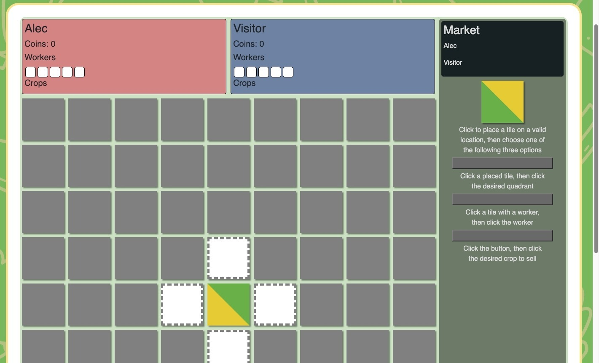

# Cropposition 🧅💰🌽
<p align="center">
<strong>Cropposition is a thrilling online board game that brings the excitement of farming and strategy right to your fingertips.</strong> 
</p>

## Table of Contents

- [Description](#📝-description)
    - [User Story](#👤-user-story)
    - [Acceptance Criteria](#☑️-acceptance-criteria)
- [Technologies Used](#🛠️-technologies-used)
- [Usage](#🤳-usage) 
    - [Screenshots](#📸-screenshots)
- [Credits](#💻-credits)
- [Links](#🔗-links)

----------------------------

## 📝 Description
Using cutting-edge technologies like Boardgame.io, MySql, React, and many more, Cropposition allows you to enjoy a fun and immersive gaming experience with your friends, no matter where they are. Once the game begins, you'll be transported to the game board, where you'll strategically place tiles and deploy your workers to claim and cultivate different crop areas, while also being able to engage in lively conversations with your fellow players using the in-game chat. Gather your friends, roll up your sleeves, and get ready to plant, harvest, and sell your way to victory in this one-of-a-kind online board game.


### 👤 User Story

```md
AS A lover of board games
I WANT to play a fun board style game online
SO THAT I can play with friends, even when we aren’t together physically

```

### ☑️ Acceptance Criteria

```md
GIVEN an online board game
WHEN I first open the app
THEN I am asked to log in or sign up
WHEN I choose sign up
THEN I am taken to a form with input sections including, username, email, and password
WHEN I am logged in
THEN I am shown a homepage that includes options to play a game, shop expansions, search for a user, or view the rules, along with a navbar with tabs for my profile and my messages
WHEN I  choose play
THEN I am brought to a lobby where I have the option to join a game or create a new one
WHEN I am playing a game
THEN I am shown the game board, my current game status (farmers, tokens, turn, etc.) and a sidebar where me and other players can chat during gameplay
WHEN I choose shop
THEN I am brought to a page where I can spend coins that I earned through gameplay on new titles, and expansions
WHEN I click the profile tab
THEN I am shown my user profile, including my title, the amount of coins I currently have, my game stats, and a list of my friends
WHEN I choose to edit my account 
THEN I am shown my account with the option to make changes
WHEN I click the messages tab
THEN I see a list of users I have sent or received messages from and any friend requests that have been sent my way
WHEN I click on one of those users
THEN I am taken to our conversation where we can continue to talk
WHEN I enter a username in the search bar
THEN I am shown any user that resembles the name I entered, and I am then able to add an user to my friends list
WHEN I click on a user in my friends list
THEN I am shown their profile, with a button to direct message them

```

----------------------------


## 🛠️ Technologies Used

<p align="center">
<strong>Front-End</strong>  
</p>
<p align="center">  
<a href="https://www.w3schools.com/css/"></a> 
<a href="https://getbootstrap.com/"></a> 
<a href="https://react.dev/"></a> 
</p>

<p align="center">
<strong>Back-End</strong>  
</p>
<p align="center">
<a href="https://boardgame.io/"></a> 
<a href="https://upload.io/uploader#react"></a>  </br> 
<a href="https://www.javascript.com/"></a>
<a href="https://www.npmjs.com/"></a>
<a href="https://nodejs.org/en"></a>
<a href="https://www.mysql.com/"></a>
</p>


------------------------

## 🤳 Usage

To play Cropposition follow the deployed Heroku link below, create an account, join a game and have fun!

### 📸 Screenshots

  

-------------------------

##  🔗 Links

**Deployed Application:** https://cropposition.herokuapp.com/  

Back-End Repository: https://github.com/alecryanhunter/crop-game-back

Socket Repository: https://github.com/alecryanhunter/crop-game-socket


-------------------------

## 💻 Credits 

**Alec Hunter** - https://github.com/alecryanhunter

**Rhonda Stokes** - https://github.com/aerostokes

**Anjali Roland** - https://github.com/anjaliroland

-------------------------

## License [](https://opensource.org/licenses/MIT)
<p align="center">
Copyright ©️ 2023 All Rights Reserved.
</p>